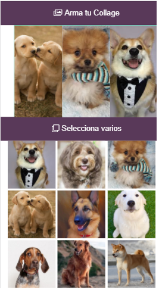

# Insta Collage

## Descripción

El reto de este proyecto es poder aplicar nuestro conocimiento en HTML 5, JavaScript ES6 y CSS, teniendo como condición las siguientes reglas:

* Visualizarse en vista mobile.
* Usar **API Drag and Drop de HTML5** para crear el collage arrastrando y soltando las imagenes.
* Libre elección en imágenes. 
 

## Herramientas utilizadas 
 1.  **HTML 5** : Estructura de la página.
 2. **JavaScript ES6** : Lenguaje de programación.
 3. **ED GRID**, framework CSS, nos sirvió para el Layaout y maquetado de la página en su versión Mobile.

## Resultado

### Colaboradores
* ***Jackeline Gessenia Canales***
* ***Kamaly Zapana***
